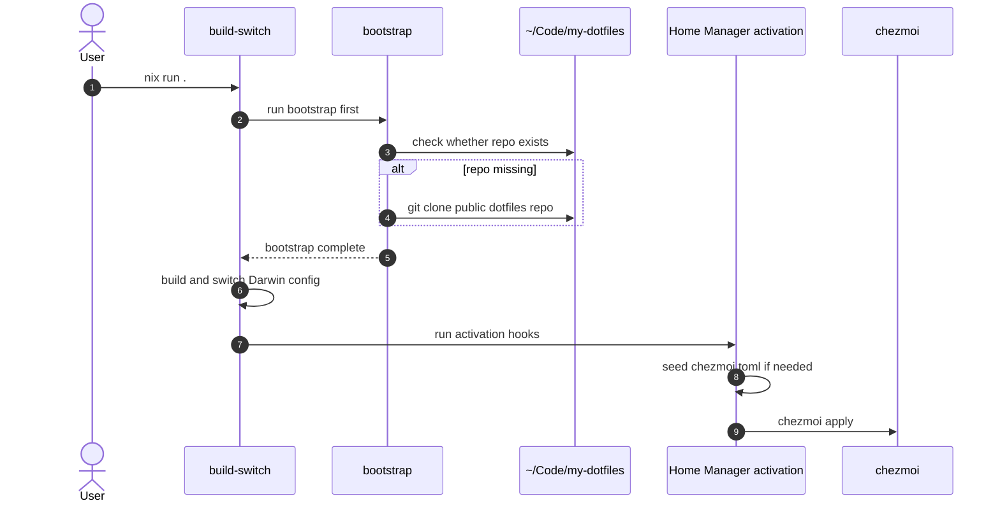
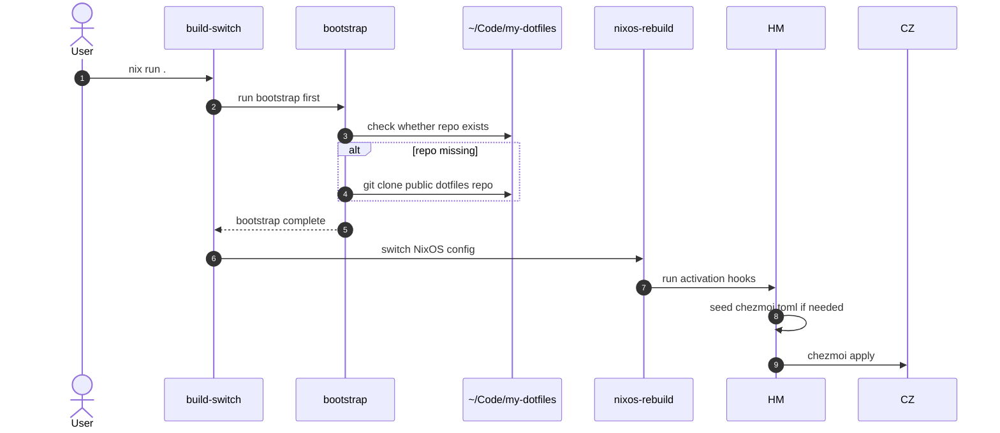

# nixos-config

This repository manages my macOS and NixOS configuration with Nix flakes,
Home Manager, nix-darwin, and chezmoi.

## How it works

Dotfiles are not injected directly from the flake output. The flow is:

1. `build-switch` first runs `bootstrap`
2. `bootstrap` ensures `~/Code/my-dotfiles` exists
3. On both macOS and NixOS, `home.activation.chezmoiApply` seeds
   `~/.config/chezmoi/chezmoi.toml` if needed, then runs `chezmoi apply`

## Usage

### macOS

```bash
nix run .#build-switch
```

This will:

- clone `https://github.com/sunick2009/my-dotfiles.git` into `~/Code/my-dotfiles`
  if the directory is missing
- build the Darwin system
- switch the machine
- apply dotfiles through the macOS Home Manager activation hook

### NixOS

```bash
nix run .#build-switch
```

This will:

- clone `https://github.com/sunick2009/my-dotfiles.git` into `~/Code/my-dotfiles`
  if the directory is missing
- switch the NixOS machine
- apply dotfiles through the Home Manager activation hook

### Explicit bootstrap

```bash
nix run .#bootstrap
```

Use this only if you want to create the dotfiles checkout without switching.

## Sequence diagram

### macOS flow



### NixOS flow



## CI

The existing CI validates evaluation and builds. It also includes a check
for the bootstrap and apply wiring so the `build-switch -> bootstrap ->
chezmoi apply` path does not silently regress.
